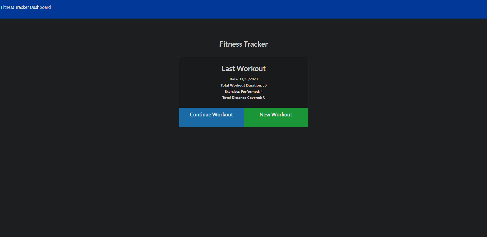
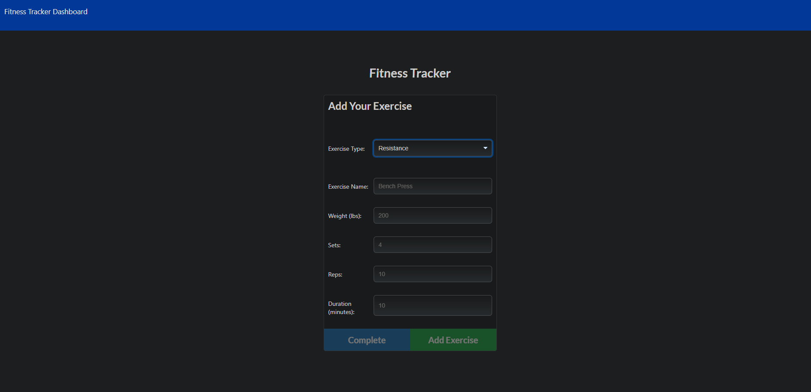
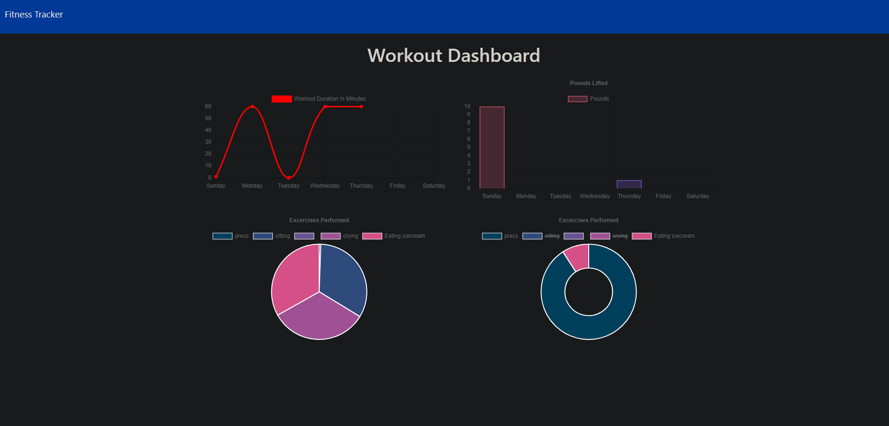

# Workout Tracker

Workout Tracker is an application that can be used to view, create, and track daily workouts. The user is able to log multiple exercises in a workout on a given day as well as track the name, type, weight, sets, reps, and duration of exercise. If the exercise is a cardio exercise, you can log the distance traveled.

## Screenshots

## Technologies
[Node](https://nodejs.org/en/) was used on the backend to execute JavaScript Code outside the web browser. 

[Express](https://expressjs.com/) web framework was used to create routes, create route handlers, handle errors, serve static files, as well as use middleware for additional request processing. 

[MongoDB](https://www.mongodb.com/) was used as the database to store the data. 

[Mongoose.js](https://mongoosejs.com/) was used to organize and manage the data held within the database. 

## Project Links
A link to the [Workout Tracker](https://nameless-springs-49152.herokuapp.com/) application is deployed on Heroku. 

A link to [Workout Tracker](https://github.com/nikolaslenning/Workout-Tracker) repository hosted on Github.

## Credits 
This application was authored by [Nikolas Lenning](https://github.com/nikolaslenning).